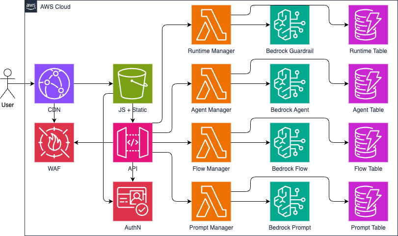

# Fraud Detection and Prevention (FDP) Agentic Platform

Fraud Detection and Prevention (FDP) Agentic Platform is leveraging artificial
intelligence (AI) and machine learning (ML) capabilities to empower customers
with ability to detect, prevent, and mitigate fraudulent activities across
Financial Services Industry (FSI) business operations. This platform aims to
help business users to establish powerful agentic workflows to detect and
prevent fraud through real-time monitoring and automated response mechanisms.

## Architecture Diagram



## Getting Started

This solution is designed to be flexible and robust with modular code stored
across the following directories:

1. `app/` - Application Code
    * `app/api/` - Backend MicroServices (Python)
    * `app/gui/` - Frontend MicroSite (JavaScript)
2. `bin/` - Deployment and Operational Scripts
3. `docs/` - Documentation and Markdown Files
4. `iac/` - Infrastructure as Code
    * `iac/api/` - API Infrastructure (Terraform)
    * `iac/cicd/` - CI/CD Pipeline (Terraform)
    * `iac/gui/` - GUI Infrastructure (Terraform)

### Pre-requisites

* an [AWS account](https://docs.aws.amazon.com/accounts/latest/reference/manage-acct-creating.html)
* already installed [JQ](https://jqlang.github.io/jq/download/),
[AWS CLI](https://docs.aws.amazon.com/cli/latest/userguide/getting-started-install.html),
[Terraform](https://developer.hashicorp.com/terraform/tutorials/aws-get-started/install-cli), and
[Terragrunt](https://terragrunt.gruntwork.io/docs/getting-started/install/)
* [AWS access keys](https://docs.aws.amazon.com/accounts/latest/reference/credentials-access-keys-best-practices.html)
used by AWS CLI
* allowed AWS CLI permissions to create
[AWS Identity and Access Management (IAM) roles](https://docs.aws.amazon.com/IAM/latest/UserGuide/id_roles_create.html)
and [AWS CodeBuild project](https://docs.aws.amazon.com/codebuild/latest/userguide/planning.html) (e.g.,
[IAMFullAccess](https://docs.aws.amazon.com/aws-managed-policy/latest/reference/IAMFullAccess.html) and
[AWSCodeBuildAdminAccess](https://docs.aws.amazon.com/aws-managed-policy/latest/reference/AWSCodeBuildAdminAccess.html))
* an [Amazon Simple Storage Service (S3) bucket](https://docs.aws.amazon.com/AmazonS3/latest/userguide/create-bucket-overview.html)
used by terraform remote state (e.g. *fdp-backend-us-east-1*)

### Deploy CI/CD Module

Starting at the ROOT level of this repository, run the following command:

```sh
/bin/bash ./bin/deploy.sh -d iac/cicd -r us-east-1 -s fdp-backend-us-east-1
```

> REMINDER: Make sure to replace *us-east-1* with your target AWS region and
*fdp-backend-us-east-1* with your S3 bucket.

Once the build execution is successful, you should be able to login to
[AWS Management Console](https://console.aws.amazon.com/console/home), navigate
to [AWS CodeBuild](https://console.aws.amazon.com/codesuite/codebuild/projects)
service and see the newly created project named something like
*fdp-cicd-pipeline-abcd1234*.

The suffix *abcd1234* in your AWS CodeBuild project name is the solution
deployment ID. This value can be used to test this solution, once deployed
successfully.

### Deploy API Module

Using CI/CD pipeline created in the previous step, run the following commands:

```sh
aws codebuild list-projects --region us-east-1 \
    --query 'projects[?contains(@, `fdp-cicd-pipeline`) == `true`]'
```

> REMINDER: Make sure to replace *us-east-1* with your target AWS region.

The output from the previous command should be used as the `project-name` input
in the next command (just replace *fdp-cicd-pipeline-abcd1234* with new value):

```sh
aws codebuild start-build --region us-east-1 \
    --project-name fdp-cicd-pipeline-abcd1234
```

> REMINDER: Make sure to replace *us-east-1* with your target AWS region and
*fdp-cicd-pipeline-abcd1234* with the value from the previous command.

### Deploy GUI Module

Similar to previous section, use the CI/CD pipeline to deploy the GUI module:

```sh
aws codebuild start-build --region us-east-1 \
    --project-name fdp-cicd-pipeline-abcd1234 \
    --environment-variables-override FDP_DIR=iac/gui
```

> REMINDER: Make sure to replace *us-east-1* with your target AWS region and
*fdp-cicd-pipeline-abcd1234* with the value from the previous section.

## Cleaning Up

If you decide to clean up your AWS environment and remove all AWS resources
deployed by this solution, this can be easily achieved by running the following
commands:

```sh
/bin/bash ./bin/deploy.sh -c true -d iac/gui -r us-east-1 -s fdp-backend-us-east-1
```

```sh
/bin/bash ./bin/deploy.sh -c true -d iac/api -r us-east-1 -s fdp-backend-us-east-1
```

```sh
/bin/bash ./bin/deploy.sh -c true -d iac/cicd -r us-east-1 -s fdp-backend-us-east-1
```

> REMINDER: Make sure to replace *us-east-1* with your target AWS region and
*fdp-backend-us-east-1* with your S3 bucket.

## Authors

The following people have contributed to the project:

* Eduardo Campos - [@ecamposv](https://github.com/ecamposv)
* Eugene Istrati - [@eistrati](https://github.com/eistrati)

## Contributing

See the [CONTRIBUTING](./CONTRIBUTING.md) for more information.

## License

This library is licensed under the MIT-0 License.
See the [LICENSE](./LICENSE) for more information.

## Roadmap

See the
[open issues](https://github.com/aws-samples/sample-fraud-detection-and-prevention-fdp-agentic-platform/issues)
for a list of proposed features (and known issues).

## Security

See the
[Security Issue Notifications](./CONTRIBUTING.md#security-issue-notifications)
for more information.

## Support

Contributions, issues, and feature requests are welcome.
Leave us a ⭐️ if you like this project.
